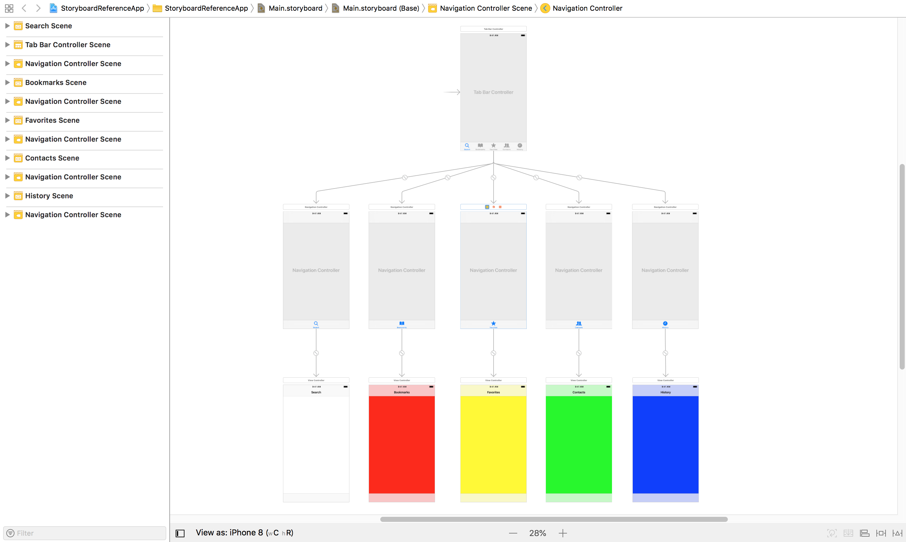
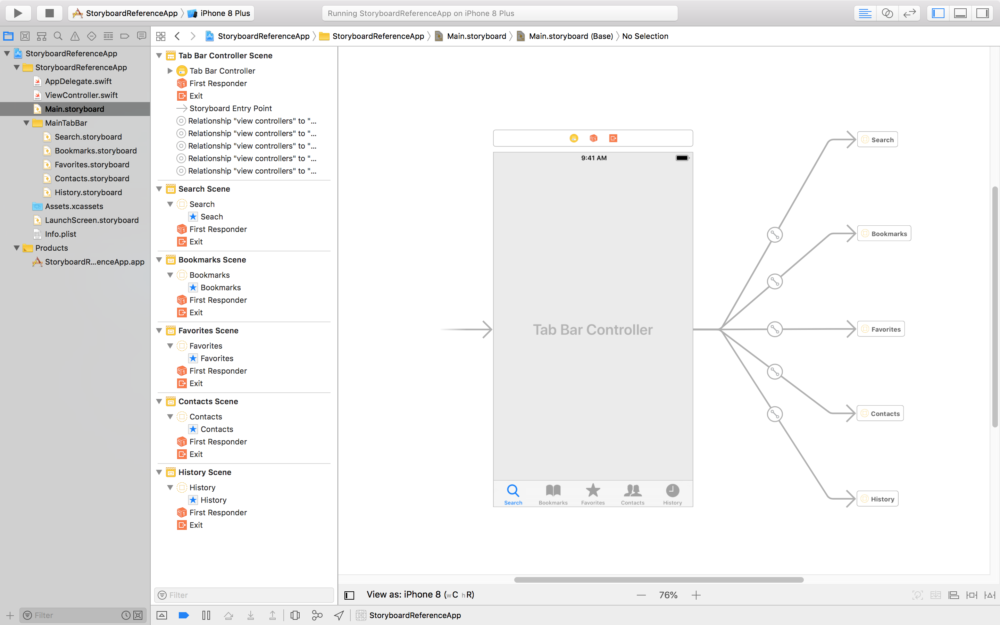

# Storyboard Referenceを活用する
実際にStoryboard Referenceを利用し、その理解を深める・学習するためのリポジトリ。  
こちらでは、既存のサンプルアプリに対してStoryboard Referenceを取り入れる工程を掲載しています。

## 詳細
[【Xcode】Storyboard Referenceを活用してみた](https://qiita.com/_CHUBURA/items/03a3cddf8fe17361c5b2)を参考までに

## 環境
- MacOS
- Xcode9
- Swift4 

## 対象者
- Storyboard Referenceを理解したい方
- Storyboard Referenceを取り入れる工程を学習したい方
- 実際にStoryboard Referenceを利用しながら理解を深めたい方
- 既存サンプルアプリを用いてStoryboard Referenceを適用してみたい方

## 構成
- [BeforeApp](/BeforeApp)  
簡単なUITabBarControllerを用いた５つのタブメニューを設けたサンプルアプリ

- [AfterApp](/AfterApp)  
上記BeforeAppに対してStoryboard Referenceを適用したサンプルアプリ

## 利用手順
1. 本リポジトリをcloneする。
2. Xcodeにて[BeforeApp](/BeforeApp) または [AfterApp](/AfterApp) を開く。
3. 以降は、[【Xcode】Storyboard Referenceを活用してみた](https://qiita.com/_CHUBURA/items/03a3cddf8fe17361c5b2) に掲載しています。
